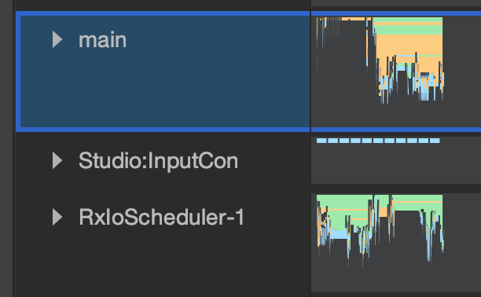

# 😡😡😡 Google Ads Demo
`Google Ads` initializes `WebView` for `Native Ad` in main thread.
This leads to problems in the application.

I start downloading ads from another thread, but the framework forcibly does work into the main thread.
Because of this, the list starts to slow down, and the `GPU` shows a high rendering time for the frame.

## Demo
`loadFromMock` and `loadFromGoogle` called in the background thread.
```kotlin
fun load(): Single<AdItem> {
    return Single
        .create<AdItem> { if (useMock) loadFromMock(it) else loadFromGoogle(it) }
        .subscribeOn(schedulersHolder.ioScheduler)
        .retryWhen { it.delay(1L, TimeUnit.SECONDS, schedulersHolder.computationScheduler) }
}

private fun createAdItem(): AdItem {
    val count = count.incrementAndGet()
    val thread = Thread.currentThread()
    return AdItem("Ad $count (${thread.name})")
}

private fun loadFromMock(singleEmitter: SingleEmitter<AdItem>) {
    if (singleEmitter.isDisposed) return
    try {
        Thread.sleep(1000L)
    } catch (interruptedException: InterruptedException) {
        return
    }
    if (singleEmitter.isDisposed) return
    val adItem = createAdItem()
    singleEmitter.onSuccess(adItem)
}

private fun loadFromGoogle(singleEmitter: SingleEmitter<AdItem>) {
    if (singleEmitter.isDisposed) return
    if (!isInitialized) {
        isInitialized = true
        MobileAds.initialize(context)
    }
    val adListener = object : AdListener() {

        override fun onAdFailedToLoad(errorCode: Int) {
            if (singleEmitter.isDisposed) return
            val throwable = Throwable()
            singleEmitter.onError(throwable)
        }

    }
    val adRequest = AdRequest.Builder()
            .build()
    AdLoader.Builder(context, "ca-app-pub-3940256099942544/2247696110")
            .forUnifiedNativeAd {
                destroyUnifiedNativeAd(it)
                if (singleEmitter.isDisposed) return@forUnifiedNativeAd
                val adItem = createAdItem()
                singleEmitter.onSuccess(adItem)
            }
            .withAdListener(adListener)
            .build()
            .loadAd(adRequest)
}
```
| Scroll with mock | Scroll with Google Ads |
|-|-|
|  |  |

## Let's conduct a study of one ad
This code called in the background thread.
```kotlin
Debug.startMethodTracing()
MobileAds.initialize(context)
val adRequest = AdRequest.Builder()
        .build()
AdLoader.Builder(context, "ca-app-pub-3940256099942544/2247696110")
        .forUnifiedNativeAd { Debug.stopMethodTracing() }
        .build()
        .loadAd(adRequest)
```

## Results



